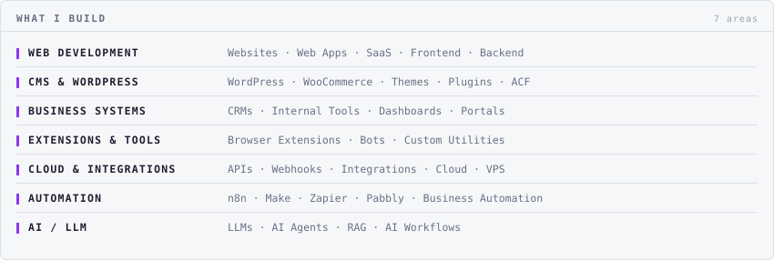
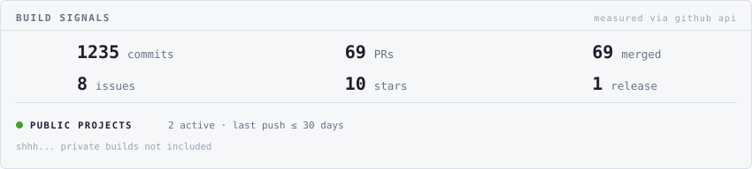
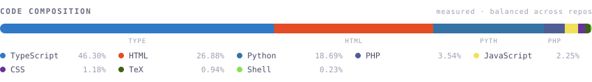

### 👋 Who am I?

I'm a **full-stack developer & product builder** who turns messy ideas into **shipped software**.

I work across **web development**, building everything from **web apps and CMS websites to custom WordPress themes, plugins, business systems, browser extensions, Cloud, APIs, automation and AI/LLM workflows**. I like learning what's needed, figuring out the hard parts and turning ideas into something that actually works.

> 💡 Problem → 🧠 Figure it out → 🏗️ Architect → ⚙️ Build → 🚀 Ship

 

<picture><source media="(prefers-color-scheme: dark)" srcset="assets/dark/whatibuild.svg"/></picture>

<picture><source media="(prefers-color-scheme: dark)" srcset="assets/dark/signals.svg"/></picture>

<picture><source media="(prefers-color-scheme: dark)" srcset="assets/dark/composition.svg"/></picture>

### 📬 Find me here

📧 [toomanybit@gmail.com](mailto:toomanybit@gmail.com) · 🌐 Portfolio coming soon

<!-- cards are generated: `node generate.mjs` (also refreshed every 6h by CI) -->
